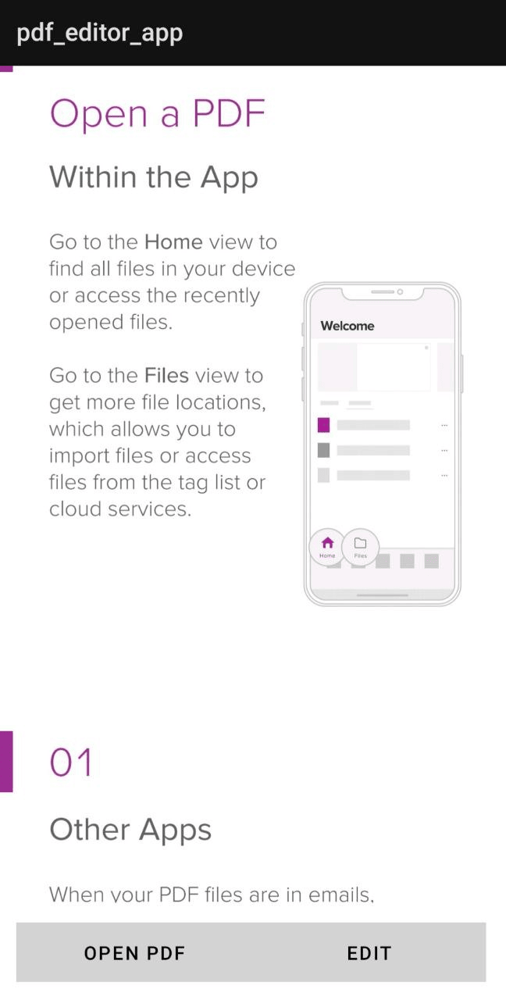
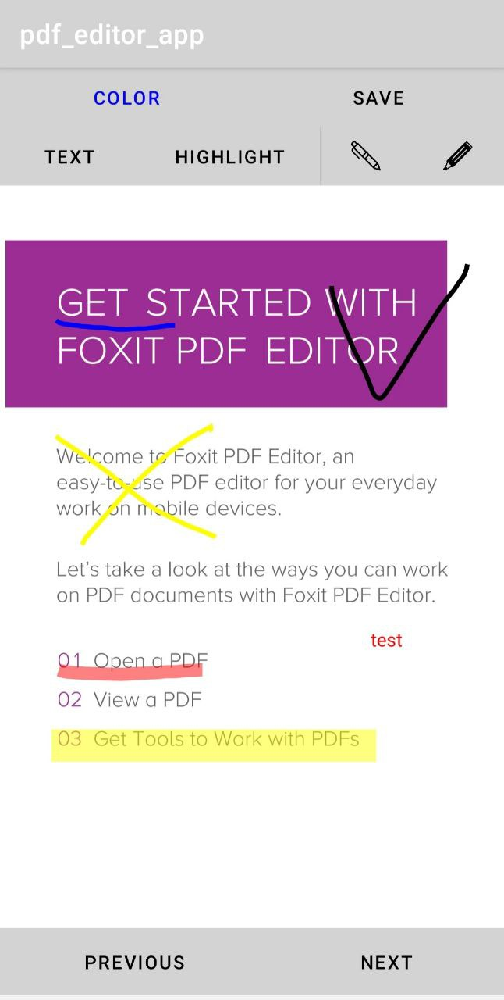

# PDF EDITOR

    
    

## Description
This application allows you to view and edit PDF files. It has three main features: drawing, text highlighting (not very good, but it's something), and adding annotations. The application was created as part of a university project. I apologize for the messy code, but it works! ;) 
The application saves annotations in the "Downloads" folder on your device. You have the option to choose the output file name. When editing, you can select from six color shades, as well as choose the drawing tool: marker or pen. When creating a text annotation, the saved comments will be added in a format compatible with other popular PDF editors.
It is also worth noting that with my approach, the quality of the page images is preserved, and the edited file can be re-edited.

## Installation
The installation is simple and standard; however, when launching, you need to grant the application permission to access files from the phone's storage.

## Libraries
I used two libraries to work with PDF: com.itextpdf.android:kernel-android:7.2.2 and com.github.mhiew:android-pdf-viewer:3.2.0-beta.3
